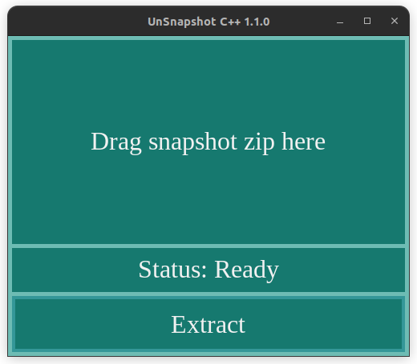

# UnSnapshot

Tool for unzipping traces of a specific kind created with HkUI self-made library.
Provides user friendly interface with a ```Status``` bar indicating percentage of completion
and the, of course, state in which the application currently resides.

### Usage

Just drag&drop the zip containing the traces and press ```Extract```. Output will be created in ```output/``` folder
in the same directory as the dragged zip.




### Building

If you want to build the application youself, the directory ```hkui_lib``` contains the includes and library necessary
to build the project (it is included due to early stages of hkui lib development that lead to many changes) either on
Linux or on Windows.


Produced executable doesn't contain any dynamic dependencies that user shall further install.

#### For Linux:
```bash
    chmod +x ./build.sh
    ./build.sh
```
```bash
    Build dependencies: hkui GLFW glew freetype
```
---
#### For Windows:
```cmd
    cmake .
    make
```
```cmd
    Build dependencies: hkui GLFW glew freetype
```

If you have **gitbash** installed, the build.sh from Linux can be ran as well.

---

Before building, make sure you **fill all** the necessary locations for the include/lib dependencies:

```bash
    # Deps include path
    set(HKUI_LIBRARY_INCLUDE_DIRECTORY "path to include of hkui")
    set(FT_LIBRARY_INCLUDE_DIRECTORY "path to include of ft")
    set(GLEW_LIBRARY_INCLUDE_DIRECTORY "path to include of glew")
    set(GLFW_LIBRARY_INCLUDE_DIRECTORY "path to include of glfw")

    ...

    set(HKUI_LIBRARY_PATH_DIRECTORY "path to lib of hkui")
    set(FT_LIBRARY_PATH_DIRECTORY "path to lib of ft")
    set(GLEW_LIBRARY_PATH_DIRECTORY "path to lib of glew")
    set(GLFW_LIBRARY_PATH_DIRECTORY "path to lib of glfw")    
```
